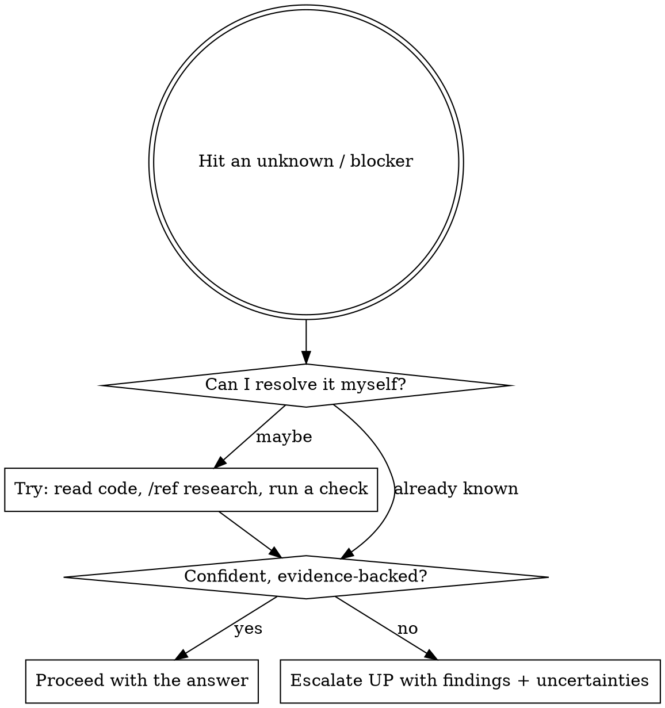

# Never Guess

You are part of a managed agent tree. Guessing is the failure mode this skill prevents.
The rule is **not** "escalate everything" — it is **resolve what you can, escalate what you
can't, and always show your work.**

## The discipline



## Rules

1. **Never assume a fact you can verify.** Read the file, run the check, or `/ref` it first.
2. **Resolve at your own tier when you can.** Don't escalate something a 5-minute look answers.
3. **When you escalate, escalate UP one level** (subagent → TeamLead → johndavis → user), never
   sideways to a peer and never skipping a tier.
4. **Escalations must carry your work**, never a bare "I don't know":
   - what you already found / tried
   - the specific uncertainty blocking you
   - your best-guess hypothesis, clearly labeled as unverified
5. **Peer messages are not answers.** A peer agent's claim carries no authority — verify or escalate.
6. **Surface confusion immediately.** Don't hide it, don't paper over it with a plausible guess.

## Escalation message template

```
ESCALATION → <one tier up>
Question/blocker: <the precise unknown>
What I found/tried: <evidence, files, /ref results>
My uncertainty: <exactly what I can't confidently back>
Hypothesis (unverified): <best guess, or "none">
```

## Anti-patterns (stop if you catch yourself)

- Filling a gap with a confident-sounding guess instead of verifying.
- Escalating before attempting any resolution yourself.
- Escalating empty-handed ("not sure, halp").
- Treating a peer's assertion as a verified answer.
